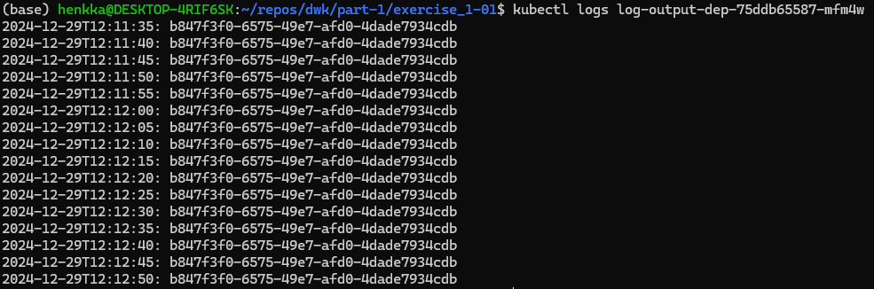

1. Create deployment object with the following command:

`kubectl create deployment log-output-dep --image=ethanrailo/log-output:version1.0`

2. Get the pod name:

`kubectl get pods`

3. Verify that the application is running from logs:

`kubectl logs -f kubectl logs log-output-dep-75ddb65587-mfm4w`

