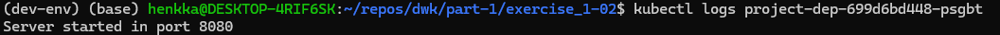

1. Create deployment object with the following command:

`kubectl create deployment project-dep --image=ethanrailo/dwk_project:version0.1`

2. Get the pod name:

`kubectl get pods`

3. Verify that the application is running from logs:

`kubectl logs project-dep-699d6bd448-psgbt`

