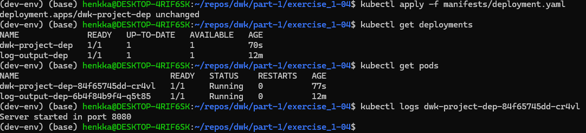

1. Apply the deployment (Dockerfile and python script can be found in exercise_1-02 -folder):

`kubectl apply -f manifests/deployment.yaml`

2. Verify that the application is running from logs:

`kubectl logs -f kubectl logs log-output-dep-6b4f84b9f4-q5t85`

