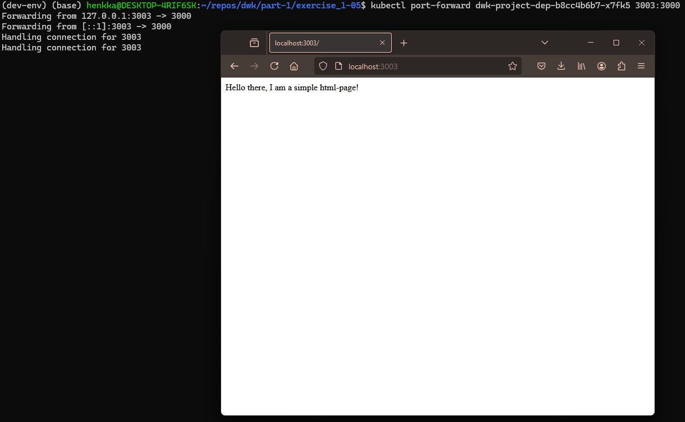

1. Apply the deployment:

`kubectl apply -f manifests/deployment.yaml`

2. Get the pod name:

`kubectl get pods`

3. Verify that the application is running from logs:

`kubectl logs dwk-project-dep-b8cc4b6b7-x7fk5`

4. Create a port-forward to confirm, that the project is accessible:

`kubectl port-forward dwk-project-dep-b8cc4b6b7-x7fk5 3003:3000`

