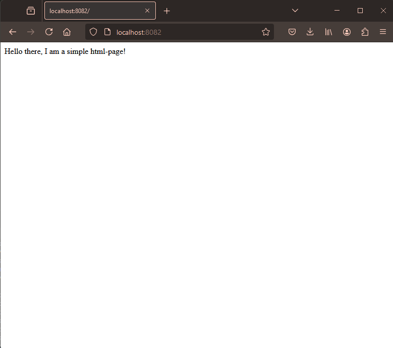

1. Apply the deployment from the previous exercise:

`kubectl apply -f ../exercise_1-05/manifests/deployment.yaml`

2. Apply the service from manifest:

`kubectl apply -f manifests/service.yaml`

3. Browse to http://localhost:8082 and verify, that the page is loading.

