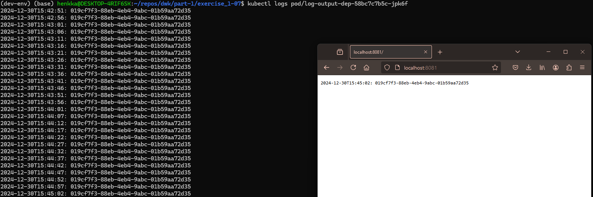

1. Apply the manifests (deployment, service, ingress):

`kubectl apply -f manifests/`

2. Verify that the deployment is done and you can see also the pod & service & ingress:

`kubectl get deployments,pod,svc,ing`

3. Verify that the logging is still working as expected:

`kubectl logs -f kubectl logs log-output-dep-75ddb65587-mfm4w`

4. Verify that you can see the most recent log message from browser

