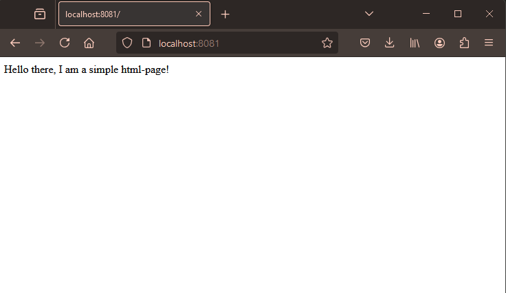

1. Apply the manifests (deployment, service, ingress):

`kubectl apply -f manifests/`

2. Verify that the deployment is done and you can see also the pod & service & ingress:

`kubectl get deployments,pod,svc,ing`

3. Verify that you can access the page at http://localhost:8081

