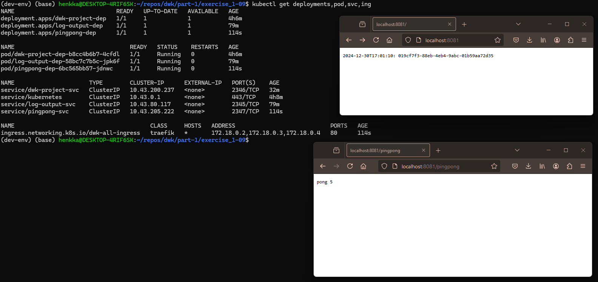

1. Make sure that you have applied log-output deployment & service-manifest from exercise_1-07 & there is no existing ingress

2. Apply the new manifests (deployment, service, ingress):

`kubectl apply -f manifests/`

3. Verify that the deployment is done and you can see also the pod & service & ingress:

`kubectl get deployments,pod,svc,ing`

4. Verify that you can access the page at http://localhost:8081 & http://localhost:8081/pingpong and the counter is rising in the pingpong one.

