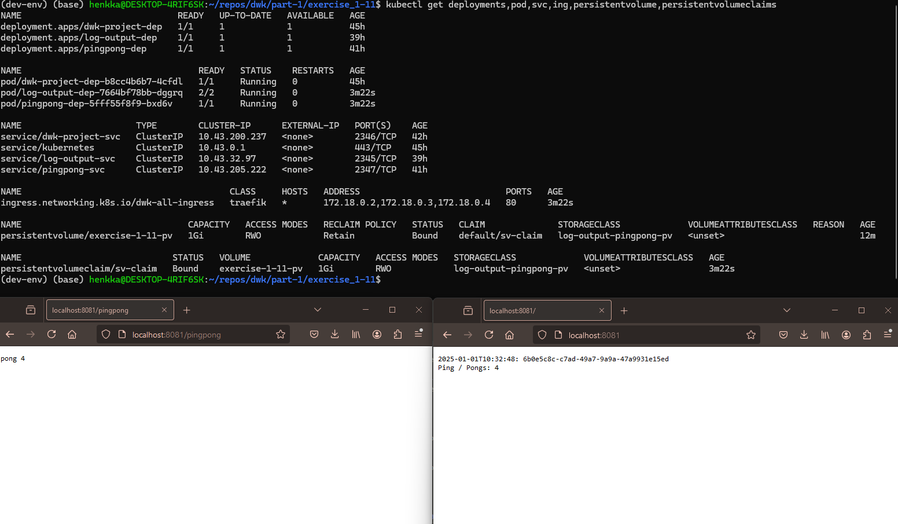

1. Apply the new persistent volume manifest:

`kubectl apply -f persistent_volume_config/manifests/`

2. Apply the new/updated manifests for log-output and pingpong (deployments, services, persistent volume claim, ingress):

`kubectl apply -f manifests/`

2. Verify that the deployment is done and you can see also the pod & service & ingress & persistent volume & pv claims:

`kubectl get deployments,pod,svc,ing,persistentvolume,persistentvolumeclaims`

3. Verify that you can access the pages at http://localhost:8081 & http://localhost:8081/pingpong and they are giving expected results.

