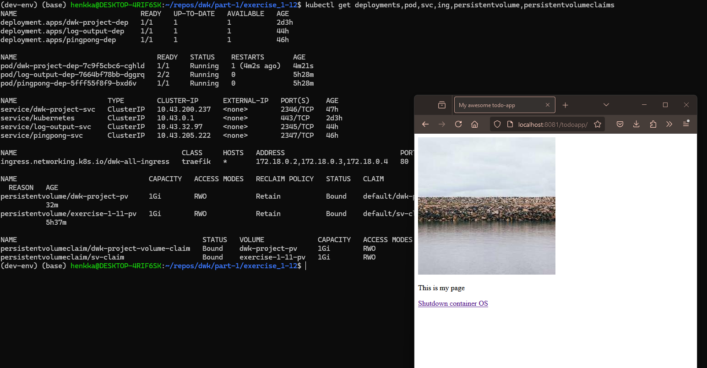

1. Create new folder in the k3d-container for the persistent volume

`docker exec k3d-k3s-default-agent-0 mkdir -p /tmp/kube-project`

2. Apply the new persistent volume manifest:

`kubectl apply -f persistent_volume_config/manifests/`

3. Apply the new/changed manifests:

`kubectl apply -f manifests/`

4. Verify that the deployment is done and you can see also the pod & service & ingress & persistent volume & pv claims:

`kubectl get deployments,pod,svc,ing,persistentvolume,persistentvolumeclaims`

5. With the current ingress.yaml the DWK-project app (todo app) is accessible in http://localhost:8081/todoapp/. Also the other apps are accessible form http://localhost:8081 & http://localhost:8081/pingpong (if the deployments are up).

