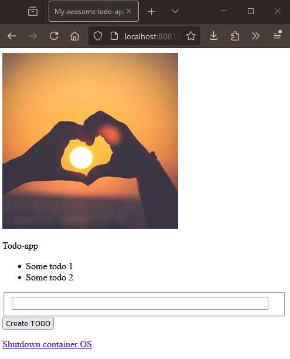

1. Apply the changed deployment manifest:

`kubectl apply -f manifests/deployment.yaml`

2. With the current ingress.yaml the DWK-project app (todo app) is accessible in http://localhost:8081/todoapp/. Also the other apps are accessible form http://localhost:8081 & http://localhost:8081/pingpong (if the deployments are up).

