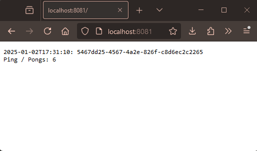

1. Apply the new/updated manifests for log-output and pingpong:

`kubectl apply -f manifests/`

3. Verify that you can access the pages at http://localhost:8081 & http://localhost:8081/pingpong and they are giving expected results. New endpoint for getting just the pong count can be found at http://localhost:8081/pingpong/count.

