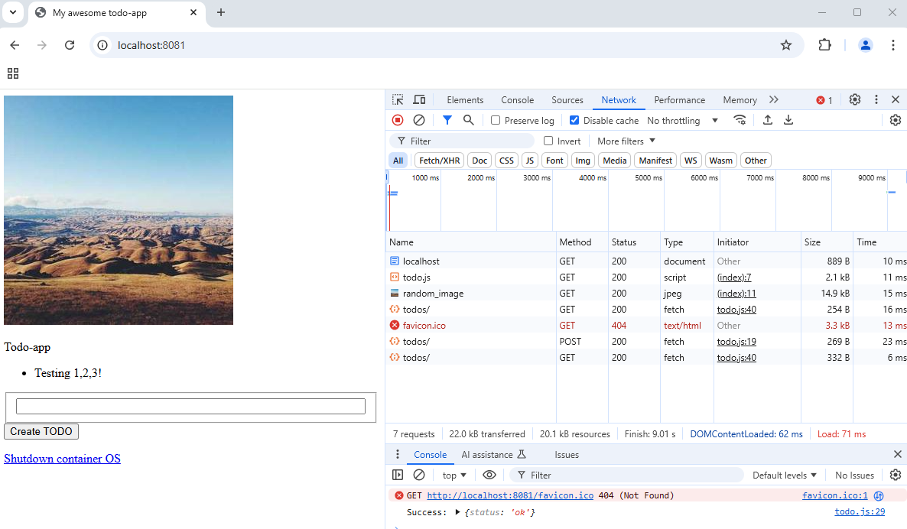

1. Apply the new/changed manifests:

`kubectl apply -f manifests/`

You can also get rid of the old deployment:

`kubectl delete deployment dwk-project-dep`

2. Verify that the deployment is done and you can see also the pod & service & ingress & persistent volume & pv claims:

`kubectl get deployments,pod,svc,ing,persistentvolume,persistentvolumeclaims`

3. With now changed ingress.yaml, you can access the project todo-app using http://localhost:8081 (in the root) and the log-output endpoint has been moved to http://localhost:8081/logoutput

Because I chose Django as my framework in the beginning, I had to make kind of quick-and-dirty separtation of the frontend and the backend, both now running Django - this is not optimal in any way, but this allowed me to continue without huge changes because of the separeted frontend.
