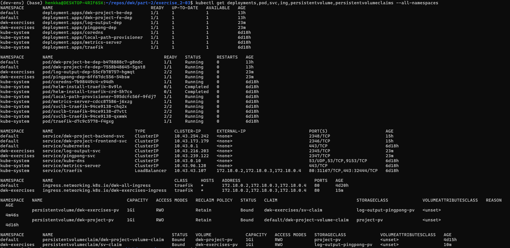

1. Create a new namespace for the exercises:

`kubectl create namespace dwk-exercises`

2. Apply the new/changed manifests:

`kubectl apply -f persistent_volume_config/manifests/`
`kubectl apply -f manifests/`

You can also get rid of the old deployments, services, persistent volume claim and persistent volume:

`kubectl delete deployment.apps/log-output-dep`
`kubectl delete deployment.apps/pingpong-dep`
`kubectl delete service/log-output-svc`
`kubectl delete service/pingpong-svc`
`kubectl delete PersistentVolumeClaim sv-claim`
`kubectl delete PersistentVolume exercise-1-11-pv`

2. Verify that the deployment is done and you can see also the pod & service & ingress & persistent volume & pv claims:

`kubectl get deployments,pod,svc,ing,persistentvolume,persistentvolumeclaims --all-namespaces`

3. With now updated configuration, you can access the log output app at http://localhost:8081/logoutput and pingpong-app at http://localhost:8081/pingpong . The todo-project can be still found from the root, http://localhost:8081 .

