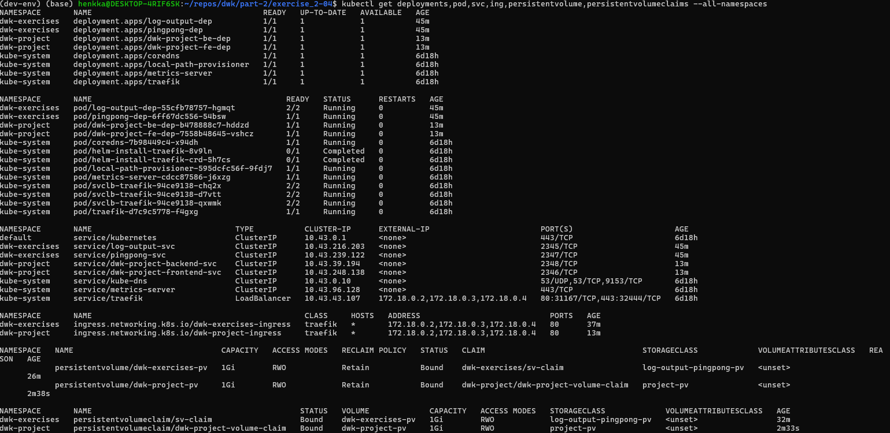

1. Create a new namespace for the exercises:

`kubectl create namespace dwk-project`

2. Get rid of the old deployments, services, persistent volume claim and persistent volume (assuming default-namespace context):

`kubectl delete deployment.apps/dwk-project-fe-dep`
`kubectl delete deployment.apps/dwk-project-be-dep`
`kubectl delete service/dwk-project-backend-svc`
`kubectl delete service/dwk-project-frontend-svc`
`kubectl delete persistentvolumeclaim/dwk-project-volume-claim`
`kubectl delete persistentvolume/dwk-project-pv`
`kubectl delete ingress.networking.k8s.io/dwk-all-ingress`

Apply the new/changed manifests:

`kubectl apply -f persistent_volume_config/manifests/`
`kubectl apply -f manifests/`

2. Verify that the deployment is done and you can see also the pod & service & ingress & persistent volume & pv claims:

`kubectl get deployments,pod,svc,ing,persistentvolume,persistentvolumeclaims --all-namespaces`

3. The todo-project can be still found from the root, http://localhost:8081, no changes here.

