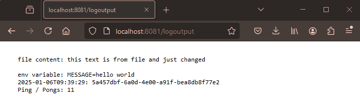

1. Apply the new/changed manifests:

`kubectl apply -f manifests/`

2. Verify that the deployment is done and you can see also the pod & service & ingress & persistent volume & pv claims & configmap:

`kubectl get deployments,pod,svc,ing,persistentvolume,persistentvolumeclaims,configmap -n dwk-exercises`

3. Verify that the view is as expected from http://localhost:8081/logoutput.

