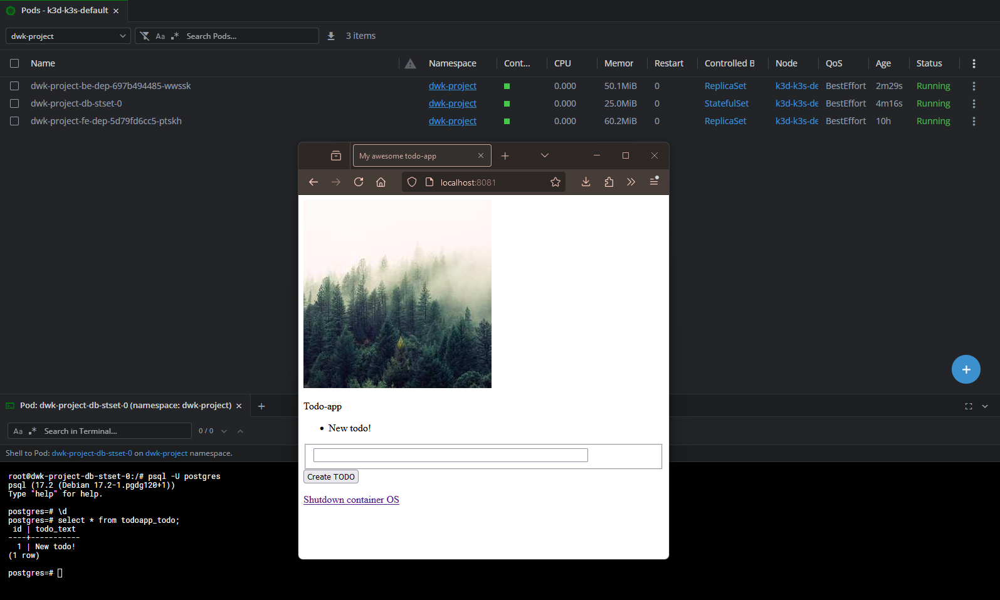

1. Encrypt the secrets/secret.yaml using the public key:

`sops --encrypt \
       --age age15tsyh0079tuszf6cxxfjzqpcnzyettjajkhttcvvsferkmkmeyuq7uad6x \
       --encrypted-regex '^(data)$' \
       secrets/secret.yaml > secrets/secret.enc.yaml`

2. Apply the secret file via piping:

`sops --decrypt secrets/secret.enc.yaml | kubectl apply -f -`

3. First apply the DB-server StatefulSet and after the StatefulSet is ready, then apply the rest of the changes:

`kubectl apply -f manifests/statefulset-db.yaml`
`kubectl apply -f manifests/`

4. Verify that the http://localhost:8081 works as expected. Backend now uses Postgres-SQL as it's database.

