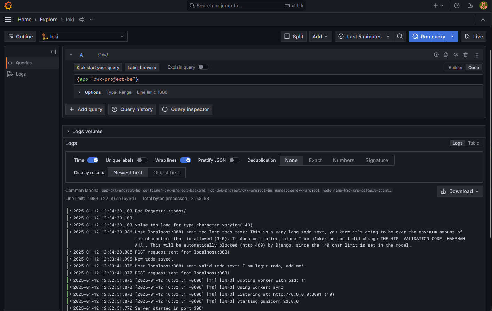

1. Apply the changed manifest for the backend-app:

`kubectl apply -f manifests/`

2. Create the port forward for the Grafana, if not running yet:

`kubectl -n prometheus port-forward kube-prometheus-stack-1736401447-grafana-7c88ff46c7-m5c2k 3000`

3. Try to create valid/invalid todo-items from browser or using some other method (postman etc.)

4. Verify that the log messages can be found from grana (Explore -> loki -> {app="dwk-project-be"}):

