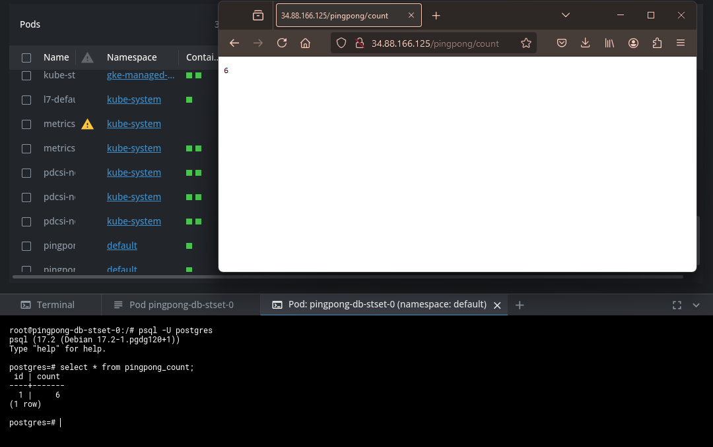
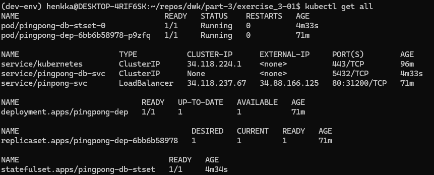

1. Encrypt the manifests/secret.yaml using the public key:

`sops --encrypt \
       --age age15tsyh0079tuszf6cxxfjzqpcnzyettjajkhttcvvsferkmkmeyuq7uad6x \
       --encrypted-regex '^(data)$' \
       secrets/secret.yaml > secrets/secret.enc.yaml`

2. Apply the secret file via piping:

`sops --decrypt secrets/secret.enc.yaml | kubectl apply -f -`

3. Apply the new deployment manifests to GKE:

`kubectl apply -f manifests/`

4. Verify that the http://34.88.166.125/pingpong works as expected and take shell to db-server and verify from psql, that the count is in the table:

`psql -U postgres`
`select * from pingpong_count;`

