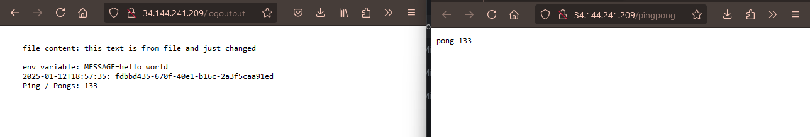
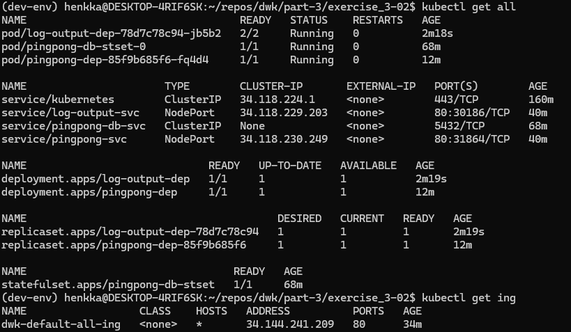

1. Remove the LoadBalancer created in the last exercise:

`kubectl delete -f ../exercise_3-01/manifests/service.yaml`

2. Apply the new deployment manifests to GKE (on top of the previous exercise):

`kubectl apply -f manifests/`

3. Verify that the http://34.144.241.209/pingpong & http://34.144.241.209/logoutput works as expected.

